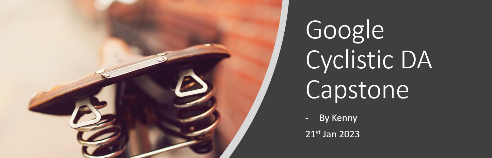
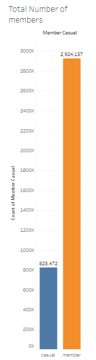
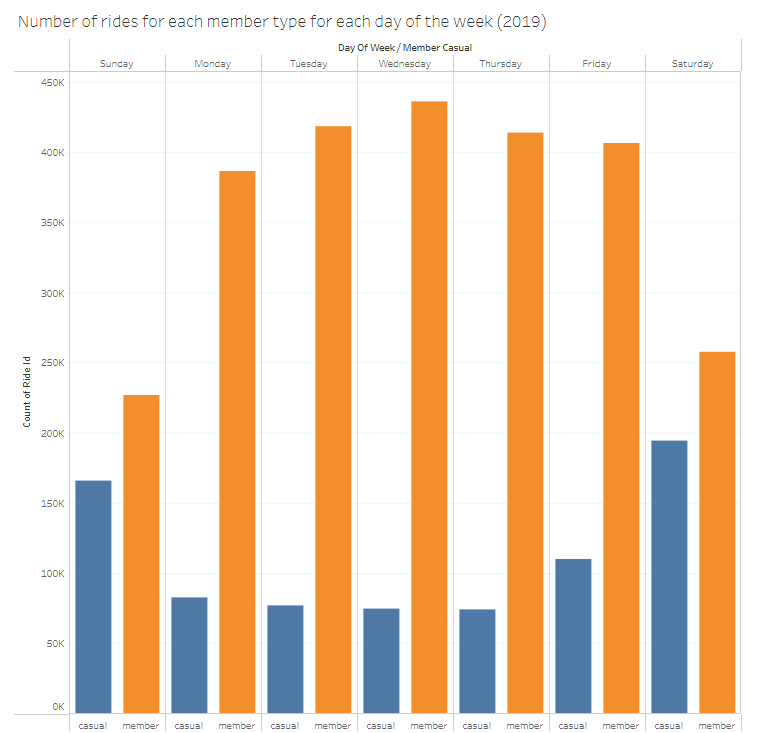
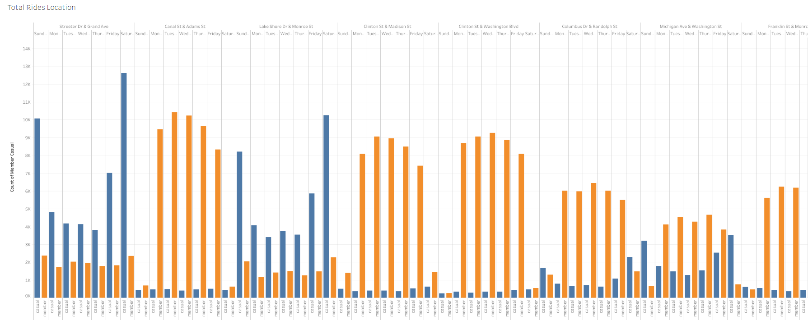

# Google DA Cyclistic Capstone
This is my Google Data Analytics Cyclistic Capstone Project

The raw data for my cyclistic capstone project is included in a url in the rmd file, remember to set the working directory accordingly and ensure that you have the required packages installed, (tidyverse, lubridate, and ggplot2)

All visualizations created are done using tableau, and can be accessed using the link in the powerpoint slide or via this link: https://public.tableau.com/views/GoogleCyclisticCapstone/Avgridelength?:language=en-US&:display_count=n&:origin=viz_share_link. 

Please start from the Cyclistic DA Capstone rmd file or the html file if RStudio is not installed, followed by the Cyclistic Capstone powerpoint.

Thanks for reading

Badge [source](https://shields.io/)

# Key findings: Annual and Casual members generally ride for different purposes; casual members for leisure, annual members for work.

## Authors

- [@kennylam365](https://www.github.com/kennylam365)

## Table of Contents

  - [Business problem](#business-problem)
  - [Data source](#data-source)
  - [Programs used](#programs-used)
  - [Data cleaning process](#data-cleaning-process)
  - [Quick glance at the results](#quick-glance-at-the-results)
  - [Assumptions and findings](#assumptions-and-Findings)
  - [Lessons learned and recommendation](#lessons-learned-and-recommendation)
  - [Limitation and what can be improved](#limitation-and-what-can-be-improved)
  - [Explore the notebook](#explore-the-notebook)
  - [Deployment on streamlit](#deployment-on-streamlit)
  - [Repository structure](#repository-structure)
  - [Contribution](#contribution)
  - [Blog post](#blog-post)
  - [Project featuring](#project-featuring)
  - [License](#license)

## Business problem

You are a junior data analyst working in the marketing analyst team at Cyclistic, a bike-share company in Chicago. You are to find out how annual and causal riders use Cyclistic bikes differently and from your findings, design a new marketing strategy to convert casual riders into annual members.

## Data source

- [Cyclistic 2019 Q2 - 2020 Q1 Data](https://divvy-tripdata.s3.amazonaws.com/index.html)

## Programs used

- R studio (data cleaning; refer to requirement.txt for the packages used in this project)
- Tableau (data vizualisation)

## Data cleaning process
The dataset contained several missing values and outliers, which required cleaning before analysis. The following steps were taken to clean the data:

- Renaming and Reordering Columns: We renamed several columns in the dataset to make them more readable for analysis. We used the rename() function in tidyverse: dplyr library of R to accomplish this.

- Formatting Data: We also formatted several columns in the dataset to ensure consistency in the data. For example, we converted the ride_id and rideable_type column to the character using the mutate function in tidyverse library of R so that they can stack correctly.

- Removing excess data: We then identified the data which has been dropped in the beginning of 2020 and removed them from our 2019 data using the -c funtion

- Combining multiple files: We combined the files from Q2 2019 to Q1 2020 using the bind_rows function in R so the file we will be able to use the files in tableau for further analysis.

- Consolidating incosistent data: Before 2020, Cyclistic used different labels for these two types of riders, customer and subscriber, we will need to consolidate those 2 labels into the current updated casual and member labels. We used the mutate function in tidyverse library of R to accomplish this.

- Adding columns: The data can only be aggregated at the ride-level, which is too granular, we added more columns for date, month, year and day will allow us to aggregate ride data for each month, day, we formatted them into month, date, year and day of week using the as.Date function in R. "ride_length" column was also created as there is no "tripduration" column in Q1 2020 file. We added the column to the entire dataframe using the mutate function in tidyverse library of R to ensure consistency.

- Handling Outliers: We then identified the outliers in the dataset using a boxplot and decided to remove them. For example, we identified several rows where the ride_length was negative, which we deemed as outliers and removed them from the dataset. We used the !() function in R to accomplish this.

By following these steps, we were able to clean and prepare the dataset for analysis. The cleaned dataset is available in the cleaned_data.csv file, which is used in our analysis.

## Quick glance at the results

Members vs Casual.

Number of rides per day.

Average ride length.

Total rides per location.

## Assumptions and findings

- **There is almost 3 times the annual rider than causal riders**
- **There are more rides from annual riders each day, and that casual riders tend to rider for a much longer duration**
- **Casual and annual memebers usually end their trips at different areas**:

  - Looking at the number of riders, we can see that there is 2.9 million annual riders compared to ~800,000 casual riders.

  - While there are more total rides each day by our annual riders, we see a spike increase in the numbers of rides for the casual riders on Fridays, Saturdays and Sundays while the number of riders for the annual members drops on Saturdays and Sundays. We also noticed that casual riders tend to ride for a longer duration as compared to annual members. All these suggests that the casual riders and annual riders ride for different purpose. 

  - To further back this point, looking at the end location of the bicycles, we notice that most of the casual members end their rides in recreational places whereas the annual members will end tend to end their rides in business districts, further supporting the findings that our casual riders and annual riders are generally riding for different purpose; casual members for leisure and annual members for commuting to work.

 **Lessons learned and recommendation**

- Based on this project's analysis, we can assume that casual and annual riders ride for different purposes. To encourage our casual riders to convert to annual riders, a good way would focus on the bulk of the casual riders who ride for recreational purposes through emphasizing the convenience, value, and benefits of an annual membership for these types of activities. By implementing these strategies, We can show how an annual membership can enhance the leisure experiences of casual riders and encourage them to upgrade to an annual membership.
- Some of the recommendations are:
-    Emphasize the value of an annual membership for recreational activities. For example, creating marketing campaigns that highlight the convenience of unlimited 45-minute rides for exploring the city's parks, beaches, and other leisure destinations. 
-    Partnering with local social media influencers who are known for promoting leisure activities in the city, such as foodies, outdoor enthusiasts, and travel bloggers. Have them showcase how Cyclistic can enhance their leisure experiences and highlight the benefits of an annual membership, such as unlimited 45-minute rides and access to exclusive events. By leveraging the influence of these social media personalities, we can reach a wider audience of potential annual members.
-    We also need to consider how casual rider have a lower frequency of using Cyclistic bike while also taking longer rides, we can offer them a special discount for an annual membership while emphasizing the value of an annual membership for infrequent riders, such as the ability to take longer rides without incurring extra fees.
-    Finally, we can create referral programs that incentivize casual members to refer their friends and family to sign up for an annual membership. Offer rewards to both the referrer and the new member, such as discounted memberships or free rentals. This not only encourages casual members to upgrade to an annual membership but also expands our customer base by attracting new members through word-of-mouth referrals.

    ***Note***: We also need to consider how often these casual riders ride their bikes, and as Cyclistic (Divvy) did not provide the numbers; more data is needed, and it is recommended that we launch a survey to look out for both the casual and annual member needs before considering our next steps.

## Limitation and what can be improved

- The lack of data for the frequency of rides by each members; if this data was provided, more insightful analysis could be performed so we would better know which group of riders to best target.
- A survey should be launched, and a more comprehensive data set can be provided.

Thank you for reading
